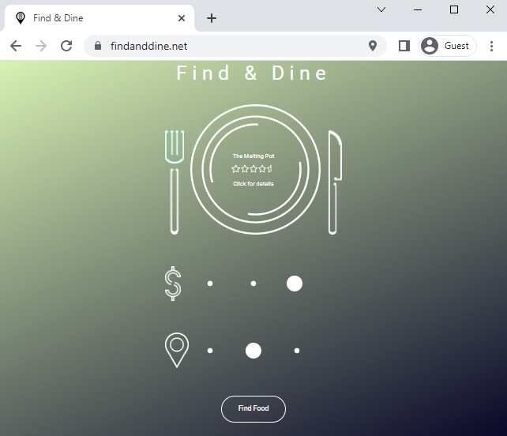

# Find and Dine
Find and Dine is a web application written in JavaScript, HTML, and CSS using React. It allows a user to randomly select a near by place to eat based on price and distance. After a place has been selected, a link to its Google Places page is displayed offering easy access to the menu, directions, and reviews.

### Tables of content
[How it works](#how-it-works)  
[Motivation](#motivation)  
[Challenges](#challenges)  
[What I would change](#what-i-would-change)

## How it works
### Interaction
The way the user interacts with this application is through their web browser using either their mouse or touch if they are on a mobile device.

### CORS and Serverless Functions
One of the biggest considerations I had when planning this project was how I would overcome Cross-Origin Resource Sharing (CORS), as I knew the Google Places API was for server-side use. My first approach was to utilize a proxy server to intercept the request to bypass a CORS error from the client. However, hosting this server when the app was production ready ended up being more time and more money than I was hoping. After further research, I stumbled upon Netlify an online build and deployment service for web apps. Netlify allowed me to deploy my server-side code as serverless functions. This meant whenever I needed to make a call to the Places API from my frontend, I could call my Netlify function instead. This eliminated all CORS errors and has the extra benefit of hiding my API key from the client.

## Motivation
My biggest motivation for this project was to create something that I could use when my girlfriend asks me where I want to get food that would eliminate the need for me to choose.

## Challenges
My biggest challenge while developing this project was creating a responsive design that would look good across a variety of devices. This task ended up taking up the majority of development time, as I went through a lot of protoypes before landing on the sleak and simple design I ended up with. 

## What I would change
The main thing I would change about this project is the addition of a way for the user to see recently visisted restaurants. The idea would be when the user clicked the link to a restaurant's Places page from the website, it would get added to a list of recently visited places. The user could then go through this list and save places they particullary enjoyed.
